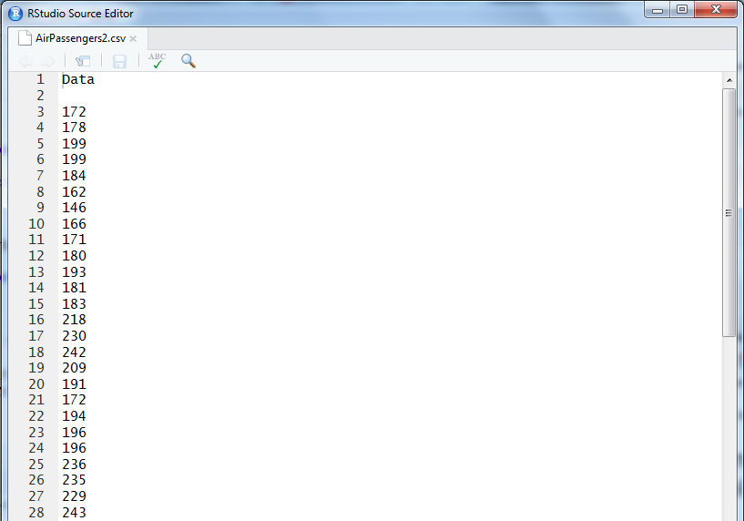

## How-to
***

#### What Type of Data does TSEonthego accept?

The uploaded file must be a *.csv* file. The first row can have a single name (e.g. My time series name). After that, or already from the start, numeric data must be provided, with decimals separated by a dot, not a comma.

As an example you can see a picture of one of the avaliable-to-download datasets:

```{r echo=FALSE, message=FALSE, warning=FALSE, paged.print=FALSE, out.width = "500px"}

```

***

#### How do the dates exactly work?

Dates are a bit tricky, since the Month input and the Day input are not exacly what they set out to be. Since a year is not equally spaced in months (some are longer than others) the Month input is not exacly the Month, but an equally separated unit for year. I hope that this is a good enough approximation. For more information look at the properties of a *ts()* object in R. We need to use such object, instead of *zoo* or *xts* since we want to use the **forecast** package, which only accepts *ts* objects.

#### Datasets

As an example, you can download the following datasets.

- [AirPassengers2](./AirPassengers2.csv) 
- [USAccDeath2](./USAccDeath2.csv) 


